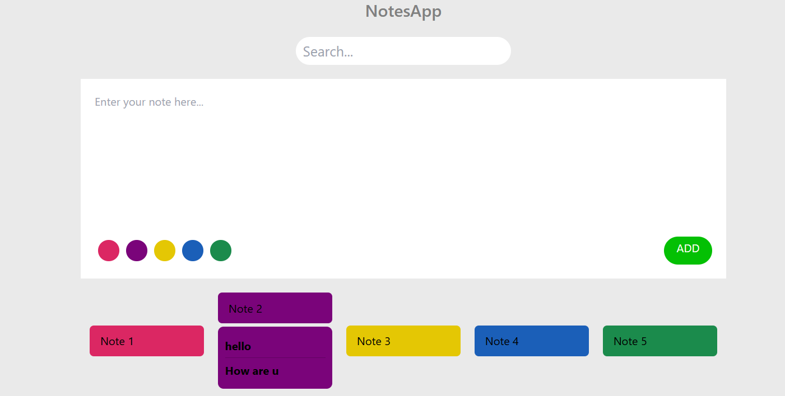

# 📝 NotesApp

NotesApp, kullanıcıların not ekleyip listeleyebildiği, notları renk seçeneklerine göre gruplayabildiği ve arayabildiği bir React uygulamasıdır.

## 🚀 Özellikler
✅ Not Ekleme: Kullanıcı, bir not yazıp istediği rengi seçerek listeye ekleyebilir.
✅ Notları Listeleme: Eklenen notlar, seçilen renk ile ekranda görünür.
✅ Renk Seçimi: Notlar için pembe, mor, sarı, mavi ve yeşil renklerinden biri seçilebilir.
✅ Renk Filtresi: Kullanıcılar belirli bir rengi seçerek sadece o renkteki notları görebilir.
✅ Not Arama: Kullanıcı, daha önce eklenen notları arayarak filtreleyebilir.

## Proje Görseli 

